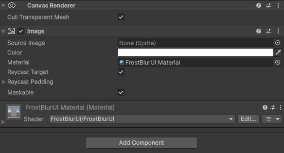
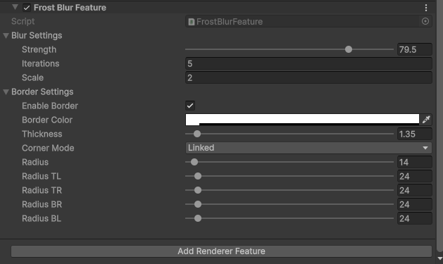

# FROST BLUR UI FOR UNITY

  

Frost Blur UI — Frosted glass blur effect for Unity UI with URP support.

Supported Versions: Supports <strong>Unity 2022.3+</strong> and <strong>newer</strong>

<h2>How it Works?</h2>

- attach FrostBlurUI material to image material

  

- add FrostBlurUI to Renderer Feauture

  

